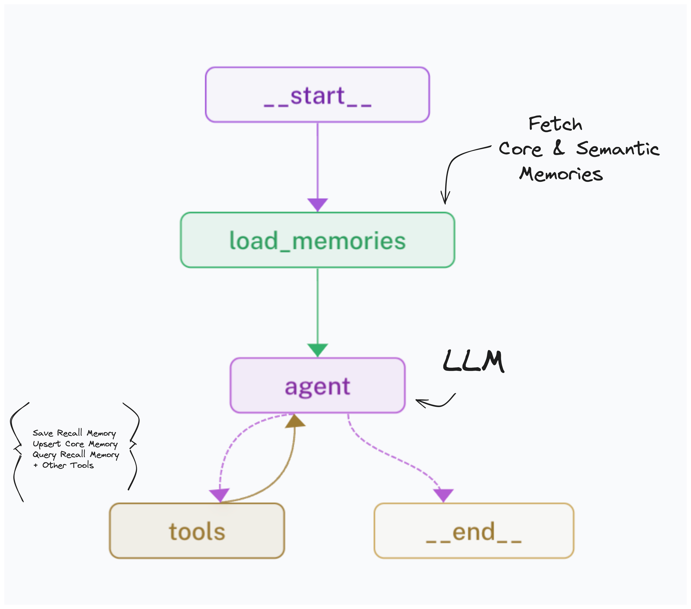

# Lang-MemGPT

This repo provides a simple example of memory service you can build and deploy using LanGraph.

Inspired by papers like [MemGPT](https://memgpt.ai/) and distilled from our own works on long-term memory, the graph
extracts memories from chat interactions and persists them to a database. This information can later be read or queried semantically
to provide personalized context when your bot is responding to a particular user.


The memory graph handles thread process deduplication and supports continuous updates to a single "memory schema" as well as "event-based" memories that can be queried semantically.



#### Project Structure

```bash
├── langgraph.json # LangGraph Cloud Configuration
├── lang_memgpt
│   ├── __init__.py
│   └── graph.py # Define the agent w/ memory
├── poetry.lock
├── pyproject.toml # Project dependencies
└── tests # Add testing + evaluation logic
    └── evals
        └── test_memories.py
```

## Quickstart

This quick start will get your agent with long-term memory deployed on [LangGraph Cloud](https://langchain-ai.github.io/langgraph/cloud/). Once created, you can interact with it from any API.

#### Prerequisites

This example defaults to using Pinecone for its memory database, and `nomic-ai/nomic-embed-text-v1.5` as the text encoder (hosted on Fireworks). For the LLM, we will use `accounts/fireworks/models/firefunction-v2`, which is a fine-tuned variant of Meta's `llama-3`.

Before starting, make sure your resources are created.

1. [Create an index](https://docs.pinecone.io/reference/api/control-plane/create_index) with a dimension size of `768`. Note down your Pinecone API key, index name, and namespac for the next step.
2. [Create an API Key](https://fireworks.ai/api-keys) to use for the LLM & embeddings models served on Fireworks.

#### Deploy to LangGraph Cloud

**Note:** (_Closed Beta_) LangGraph Cloud is a managed service for deploying and hosting LangGraph applications. It is currently (as of 26 June, 2024) in closed beta. If you are interested in applying for access, please fill out [this form](https://www.langchain.com/langgraph-cloud-beta).

To deploy this example on LangGraph, fork the [repo](https://github.com/langchain-ai/langgraph-memory).

Next, navigate to the 🚀 deployments tab on [LangSmith](https://smith.langchain.com/o/ebbaf2eb-769b-4505-aca2-d11de10372a4/).

**If you have not deployed to LangGraph Cloud before:** there will be a button that shows up saying `Import from GitHub`. You’ll need to follow that flow to connect LangGraph Cloud to GitHub.

Once you have set up your GitHub connection, select **+New Deployment**. Fill out the required information, including:

1. Your GitHub username (or organization) and the name of the repo you just forked.
2. You can leave the defaults for the config file (`langgraph.config`) and branch (`main`)
3. Environment variables (see below)

The default required environment variables can be found in [.env.example](.env.example) and are copied below:

```bash
# .env
PINECONE_API_KEY=...
PINECONE_INDEX_NAME=...
PINECONE_NAMESPACE=...
FIREWORKS_API_KEY=...

# You can add other keys as appropriate, depending on
# the services you are using.
```

You can fill these out locally, copy the .env file contents, and paste them in the first `Name` argument.

Assuming you've followed the steps above, in just a couple of minutes, you should have a working memory service deployed!

Now let's try it out.

## Part 2: Setting up a Slack Bot

The langgraph cloud deployment exposes a general-purpose stateful agent via an API. You can connect to it from a notebook, UI, or even a Slack or Discord bot.

In this repo, we've included an `event_server` to listen in on Slack message events so you can talk with
your bot from slack.

The server is a simple [FastAPI](https://fastapi.tiangolo.com/tutorial/first-steps/) app that uses [Slack Bolt](https://slack.dev/bolt-python/tutorial/getting-started) to interact with Slack's API.

In the next step, we will show how to deploy this on GCP's Cloud Run.

#### How to deploy as a Discord bot


So now you've deployed the API, how do you turn this into an app?

Check out the [event server README](./event_server/README.md) for instructions on how to set up a Discord connector on Cloud Run.


## How to evaluate

Memory management can be challenging to get right. To make sure your schemas suit your applications' needs, we recommend starting from an evaluation set,
adding to it over time as you find and address common errors in your service.

We have provided a few example evaluation cases in [the test file here](./tests/evals/test_memories.py). As you can see, the metrics themselves don't have to be terribly complicated,
especially not at the outset.

We use [LangSmith's @test decorator](https://docs.smith.langchain.com/how_to_guides/evaluation/unit_testing#write-a-test) to sync all the evalutions to LangSmith so you can better optimize your system and identify the root cause of any issues that may arise.
